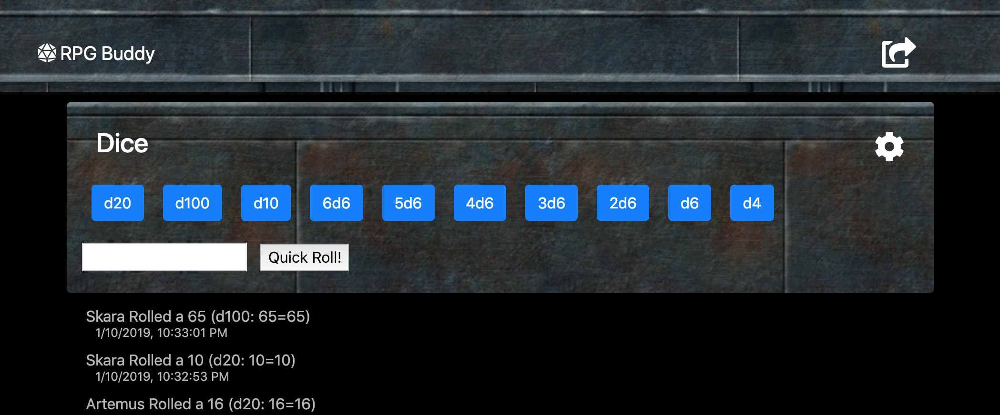

# RPG Buddy
## A free real-time helper app for players of Tabletop Role Playing Games

### Purpose
I love good ol'fashoned, nerdy Tabletop Role Playing Games (or RPGs). Titles like [Palladium's Rifts®](http://www.palladiumbooks.com/), The various Star Wars RPGs, and [Jeff Siadek's Battlestations](http://gorillaboardgames.com/battlestation/) Boardgame/ RPG hybrid are some of my favorites. RPG Buddy came about from a desire to see if I could create a mobile web-app that me and my friends could use on our phones that would not only be useful, but also look nice and be intuitive and fun to use.

### Overview
Designed with small mobile phone screens in mind, RPG Buddy is a handy group-based dice roller. It calculates user dice rolls via common gaming dice notation, and displays roll results publically so that anyone viewing the site can see the changes instantly in real-time.

Eventually, I would like RPG Buddy to be so much more than a fun colobrative RPG dice roller. However, I'm fairly happy with how it's developed thus far and look forward to future ideas and development.

- - - 

### Current Features

Dice roller

   * Common dice rolling buttons that are easy to find and use  

   * The ability to remove or add your own custom dice rolling buttons

   * Simple 'Quick-roll' input field for one-off rolls that may not warrant their own button.

   * Custom buttons and 'Quick-roll' all accept simple RPG dice notation like d20, or 3d6+2

   * No log-in or account creation required

   * Public Roll History that instantly updates any new user rolls in real time!

   * You can specify your character's name in settings to better identify all their roll results in the Roll History

   * Roll History displays to everyone the number and type of dice rolled, their respective die results, and the overall roll total

- - -

### Technology Used

In addition to the use of good 'ol JavaScript, HTML, and CSS, RPG Buddy was built using the following additional resources:

   * [Bootstrap](https://getbootstrap.com/) - for mobile-responsiveness and CSS heavy-lifting.

   * [jQuery](https://jquery.com/) - for less verbose JavaScript

   * [FontAwesome](https://fontawesome.com/) - for fantastic free icons

   * [Bootstrap-modal-ios](https://gist.github.com/thuijssoon) - for best UI experience I wanted to use modal windows on a mobile browser which has known issues in Bootstrap. Thankfully this bit of code by Thijs Huijssoon was just what I needed and was easy to impliment and modify, so thank you!

   * [droll.js](https://github.com/thebinarypenguin/droll) - fantastic rpg dice library using javascript. Supports typical dice notation like d20, 2d10, 1d8+4 etc, and then calculates the results.

   * [Firebase](https://firebase.google.com/) - Google's free real-time no SQL database for storing default button values and settings and for recording the dice roll history and pushing new entries out to web users instantly.

- - -

### Ideas For Future Development

  * Easy share scripting for sending the project url link via SMS or Email

  * Option to support dice multiper notation (ie 1d6x10)

  * The ability to animate or more elaboratly display a user's latest die roll result

  * The option to specify the desired game setting (and having the UI/background and default dice buttons change accordingly).

  * Different dice calculation options (like d6 combat dice, hit location dice, or special dice totals for systems like 2d20)

  * Ability to direct message other users

  * Ability for users to create their own RPG Buddy account for saving customizations like character name, custom or deleted buttons etc.